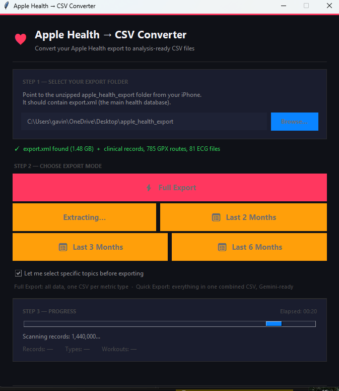
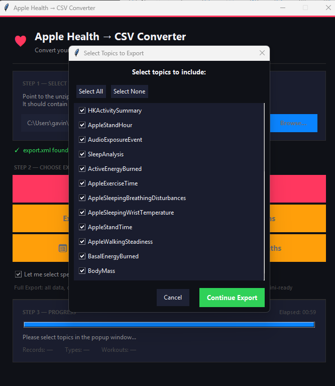

# Apple Health → CSV Converter

A standalone Windows desktop application that converts a large Apple Health export (up to 3 GB) into organized, analysis-ready CSV files.

  

---

## 📸 In Action

### Simple, 1-Click Interface
Just point it at your `apple_health_export` folder, choose a timeframe, and optionally select topics. The tool streams through gigabytes of XML data without locking up your machine.



### Pick Exactly What You Need
Select specific health topics before exporting to keep your CSV data clean and laser-focused on what you actually care about.



---

## What It Does

When you export your data from the Apple Health app on iPhone, you get a ZIP file that expands into an `apple_health_export/` folder. The core file — `export.xml` — can be **500 MB to 3+ GB** and contains millions of health data points in a deeply nested XML format that no spreadsheet or AI tool can directly consume.

This tool converts that export into **clean, flat CSV files** — one per metric type — ready to be dropped into Excel, Google Sheets, or uploaded to Gemini for analysis.

---

## Features

- 🖱️ **One-button UI** — just browse to your export folder and click Convert
- 🚀 **Streaming XML parser** — handles 3 GB files without running out of memory
- 📊 **Per-type CSV output** — one file per health metric (StepCount, HeartRate, Sleep, etc.)
- 💪 **Workout data** — sessions + per-workout statistics in dedicated CSVs
- 🏃 **Activity rings** — daily Move/Exercise/Stand goal data
- 📋 **Summary CSV** — bird's-eye view of all data for quick Gemini context
- 🔒 **100% local** — nothing leaves your machine

---

## Output Structure

Given input: `C:\...\apple_health_export\`  
Output written to: `C:\...\apple_health_export\converted\`

```text
converted/
├── _metadata.csv           ← Export info, device, iOS version
├── _summary.csv            ← One row per metric type (count, date range, unit)
├── _workouts.csv           ← All workout sessions
├── _workout_stats.csv      ← Per-workout statistics (distance, energy, HR zones)
├── _activity_summaries.csv ← Daily activity rings data
├── StepCount.csv
├── HeartRate.csv
├── ActiveEnergyBurned.csv
├── SleepAnalysis.csv
├── VO2Max.csv
... (one file per distinct record type found in your export)
```

Each record CSV has these columns:
```csv
type, sourceName, sourceVersion, device, unit, creationDate, startDate, endDate, value
```

---

## Quick Start

### Option A — Run from Source (requires Python 3.11+)

```powershell
git clone https://github.com/gavinfischer-keenan/AppleHealthConverter.git
cd AppleHealthConverter
python main.py
```

No pip installs needed — the app uses only Python's standard library.

### Option B — Build a Standalone .exe

```powershell
# Requires Python + pip
build.bat
# Creates: dist\AppleHealthConverter.exe
```

The resulting `.exe` runs on any Windows machine — **no Python installation required**.

---

## How to Export from Apple Health

1. Open the **Health** app on your iPhone
2. Tap your profile picture (top right)
3. Tap **Export All Health Data**
4. AirDrop or transfer the ZIP to your Windows PC
5. Unzip it — you'll get an `apple_health_export` folder
6. Point this tool at that folder

---

## Gemini Analysis Tips

After conversion, start a Gemini conversation with:

1. Upload `_summary.csv` first — ask Gemini to understand your data landscape
2. Upload specific type CSVs for deep analysis (e.g., `HeartRate.csv`, `SleepAnalysis.csv`)
3. Ask Gemini to correlate across files by joining on `startDate`

Example prompt:
> "Here is my Apple Health summary. What are the most interesting patterns you can analyze? Which files should I upload next?"

---

## Architecture

| File | Purpose |
|---|---|
| `main.py` | tkinter GUI — folder picker, progress display, conversion orchestration |
| `parser.py` | Streaming `iterparse` XML engine — handles large files safely |
| `writers.py` | CSV writer manager — one file per record type, lazy initialization |
| `build.bat` | PyInstaller build script → standalone `.exe` |

---

## Known Apple Health Quirks Handled

- **Invalid control characters** (`\x0b`, etc.) that break standard XML parsers
- **DOCTYPE declarations** referencing Apple's DTD (removed before parsing)
- **Optional fields** vary per record type — all handled gracefully with blank-filling
- **Nested workout statistics** — properly associated back to parent workout

---

## License

MIT License — use freely, modify as needed.
